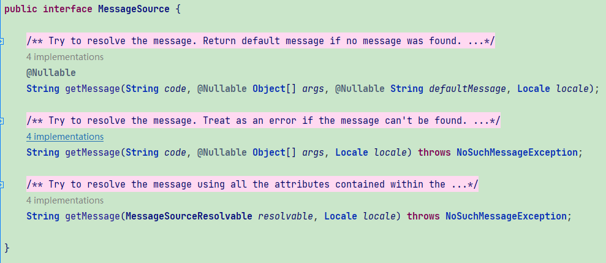
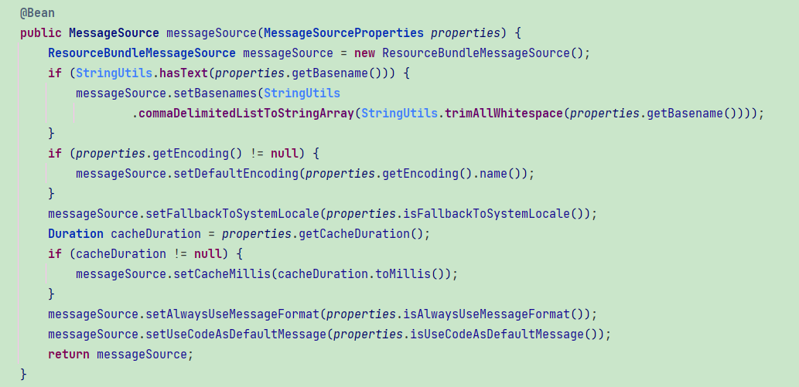
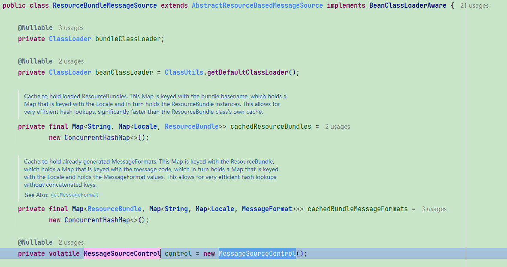
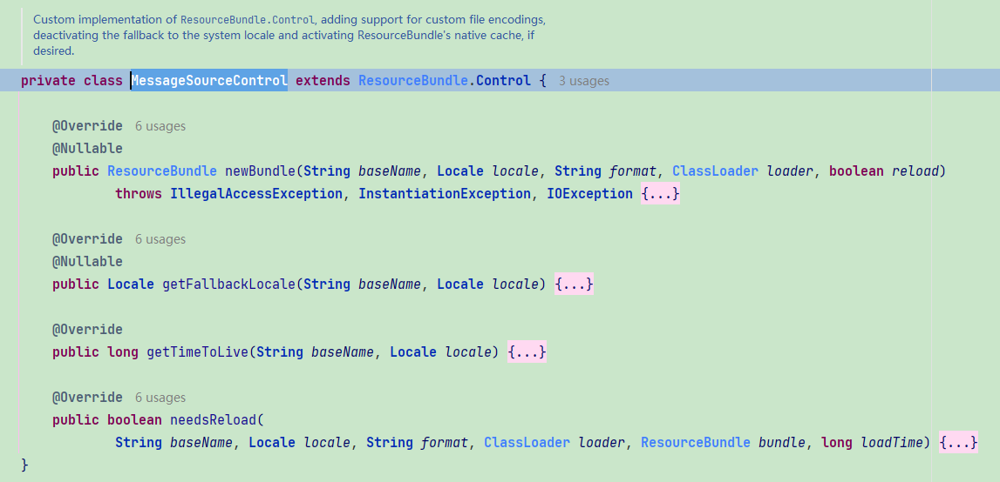
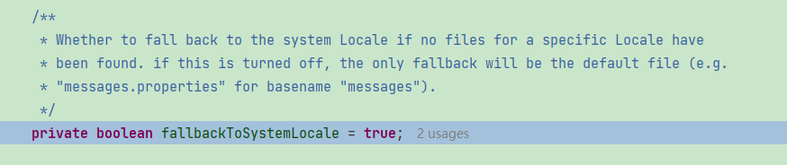

1. 启动时，会通过配置文件（比如`.yml`）中的`spring.messages`自动配置

   > `org.springframework.boot.autoconfigure.context.MessageSourceAutoConfiguration#messageSourceProperties`

2. 通过`MessageSourceProperties`配置的属性实例化一个`MessageSource`

   获取国际化值的时候就是调用`MessageSource.getMessage()`方法
   
   
   
   > `MessageSource`的实际类型为`org.springframework.context.support.ResourceBundleMessageSource`

3. `ResourceBundleMessageSource`中有一个私有的`volatile`变量`control`

   

   该变量的类型为`ResourceBundleMessageSource`的内部类

   > `org.springframework.context.support.ResourceBundleMessageSource.MessageSourceControl`

   

   在第一次调用`MessageSource.getMessage()`时会通过`MessageSourceControl#newBundle`去加载`messages.properties`文件中的内容，后续数据将放在缓存当中

   

   **使用时需要注意的点**

   `MessageSourceProperties#fallbackToSystemLocale`，默认值为`true`

   

   该参数的含义是，如果通过指定的`locale`没有找到对应的配置文件，则使用虚拟机所在系统（例如`CentOS`）默认的`locale`

   比如，在没有配置该参数的情况下：

   1. 通过`MessageSource.getMessage()`传递的`locale`为`zh`
   2. 配置文件为`messages.properties`与`messages_en.properties`
   3. 系统`locale`为`en_US`

   那么国际化的值将会从`messages_en.properties`中去获取，因为没有`_zh`的配置文件，所以拿的是系统默认的`locale`

   

   

   

   

   
