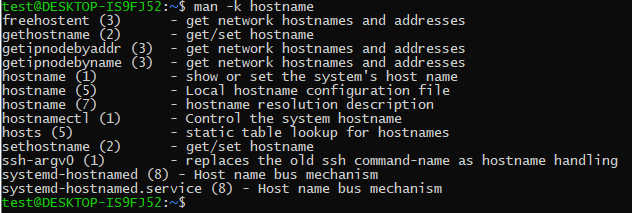
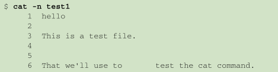
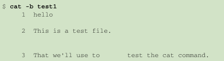
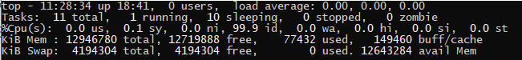
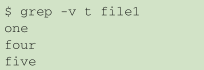
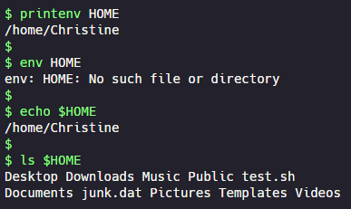
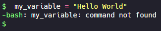
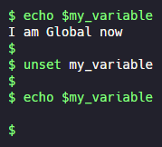
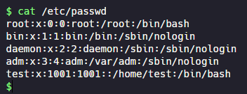

1. 通过关键字搜索手册页

   `man -k 关键字`

   例：`man -k hostname`

   

   - 后面的数字表示手册来自哪块内容

     例：查看指定命令第一部分的内容

     输入 `man 1 hostname` 就可以查看具体的内容
   
2. `ls -F`

   在没安装彩色终端仿真器时，该命令可以区分文件和目录

   

   - 目录名后面会添加正斜线`/`
   - 可执行文件后面会添加`*`
   
3. `ls -R`

   递归显示当前目录下包含的子目录中的文件。如果目录很多，这个输出就会很长
   
4. `file file_name`

   查看文件的类型
   
5. `cat -n file_name`

   给所有的行加上行号

   
   
6. `cat -b file_name`

   给有文本的行加上行号

   
   
7. `head file_name`

   显示文件开头多少行的内容。默认情况下显示10行。

   与`tail`参数类似
   
8. `top`命令显示实时的进程信息

   

   第一行显示了当前时间、系统的运行时间、登录的用户数以及系统的平均负载

   平均负载有3个值：最近1分钟的、最近5分钟的和最近15分钟的平均负载

   > 值越大说明系统的负载越高。如果近15分钟内的平均负载都很高，就说明系统可能有问题
   > 通常，如果系统的负载值超过了2，就说明系统比较繁忙了
   
9. `df`查看所有已挂载磁盘的使用情况

   有可能系统上有运行的进程已经创建或删除了某个文件，但尚未释放文件。这个值是不会算进闲置空间的
   
10. 默认情况下， `du`命令会显示当前目录下所有的文件、目录和子目录的磁盘使用情况

11. `grep -v`搜索不包含指定模式的行

    例：`grep -v t file1` 搜索`file1`中不包含`t`的行

    
    
12. `grep -n`显示匹配到的行的行号

    例：`grep -n t file1`

    
    
13. `grep -e`搜索时匹配多个模式

    例：`grep -e t -e f file1`搜索含有字符 t 或字符 f 的所有行

    
    
14. `tar function [options] object1 object2 ...` 对数据进行归档

    - function

      - `-c` --create 

        创建一个新的tar归档文件
      
      - `-x` --extract 
    
        从已有tar归档文件中提取文件
      
      - `-t` --list 
    
        列出已有tar归档文件的内容

    - options

      - `-f` file
      
        输出结果到文件或设备
      
      - `-v`
      
        在处理文件时显示文件
        
      - `-z` 
      
        将输出重定向给gzip命令来解压/压缩内容
    
    例：
    
    - `tar -cvf test.tar test/ test2/`
    
      创建了名为test.tar的归档文件，含有test和test2目录内容
    
    - `tar -tf test.tar`
    
      列出tar文件test.tar的内容（但并不提取文件）
    
    - `tar -xvf test.tar`

        从tar文件test.tar中提取内容。如果tar文件是从一个目录结构创建的，那整个目录结构都会在当前目录下重新创建

    - `tar -zxvf filename.tgz`

      解压gzip压缩过的tar文件

      > gzip压缩过的tar文件以.tgz结尾
    
15. 使用`env`或`printenv`命令查看全局变量

16. 显示个别环境变量的值，可以使用`printenv`命令或者`echo env_name`命令

    

    > `env`命令不能查看单个环境变量的值

    > 在echo命令中，在变量名前加上`$`不但可以显示变量当前的值，还能够让变量作为命令行参数

17. 设置变量时，变量名、等号和值之间没有空格

    

18. 删除环境变量

    

    > 不要使用`$`

19. 什么时候该使用`$`来引用环境变量

    如果要用到变量，使用`$` ；如果要操作变量，不使用`$` 。

    这条规则的一个例外就是使用`printenv`显示某个变量的值

20. 定位系统环境变量

    在登入Linux系统启动一个bash shell时，默认情况下bash会在启动文件中查找命令。bash检查的启动文件取决于启动bash shell的方式。

    启动bashshell有3种方式：

    - 登录时作为默认登录shell

      登录shell会从5个不同的启动文件里读取命令：

      - `/etc/profile`

        该文件是系统上默认的bash shell的主启动文件。系统上的每个用户登录时都会执行这个启动文件。

        会去读取`/etc/profile.d`目录下的所有文件，并执行这些文件

        > 在Ubuntu系统中，会去执行`/etc/bash.bashrc`文件。这个文件包含了系统环境变量

      shell会按照按照下列顺序，运行第一个被找到的文件，余下的则被忽略

      > `$HOME/.bashrc`文件通常通过其他文件运行的

      - `$HOME/.bash_profile`
      - `$HOME/.bash_login`
      - `$HOME/.profile`
      - `$HOME/.bashrc`

    - 作为非登录shell的交互式shell（在命令行提示符下敲入bash时启动）

      只会检查用户`HOME`目录中的`.bashrc`文件

    - 作为运行脚本的非交互shell（系统执行shell脚本时）

      - 检查环境变量`BASH_ENV`是否有指定的执行文件
      - 使用当前shell的局部变量和全局变量
    
21. 环境变量持久化

    - 全局环境变量

      在`/etc/profile.d`目录中创建一个以`.sh`结尾的文件。把所有新的或修改过的全局环境变量设置放在这个文件中

    - 用户环境变量

      存储个人用户永久性shell变量的地方是`$HOME/.bashrc`文件

22. `/etc/passwd`文件

    

    字段包含了如下信息：

    - 登录用户名
    - 用户密码
    - 用户账户的UID（数字形式）
    - 用户账户的组ID（GID）（数字形式）
    - 用户账户的文本描述（称为备注字段）
    - 用户`HOME`目录的位置
    - 用户的默认shell

    `root`用户账户是Linux系统的管理员，固定分配给它的`UID`是`0`

    Linux为系统账户预留了`500以下`的UID值

    密码字段都被设置成了`x`

    > 用户密码保存在另一个单独的文件`/etc/shadow`中，只有特定的程序（比如登录程序）才能访问这个文件

23. 添加新用户

    `useradd -m username`

    - `-m` 创建用户的`HOME`目录

      系统会将`/etc/skel`目录下的内容复制到用户的`HOME`目录下

    - `-g` 指定用户登录组的GID或组名

24. 删除用户

    - `userdel username` 

      删除`/etc/passwd`文件中的用户信息，但是不会删除属于该账户的任何文件

    - `userdel -r username`

      会删除用户的`HOME`目录以及邮件目录

      > 慎用，因为有可能其他程序要使用的文件在`HOME`目录

25. 修改用户

    - `usermod -L username` 锁定账户，使用户无法登录

    - `usermod -U username` 解除锁定，使用户能够登录

    - `usermod -G group_name username` 将指定用户添加到指定组

      > 用户必须重新登录，组关系的更改才能生效

    - `passwd [username]`

      如果只用`passwd`命令，它会改你自己的密码。系统上的任何用户都能改自己的密码，但只有`root`用户才有权限改别人的密码

26. 创建新组

    `groupadd group_name`

    创建新组时，默认没有用户被分配到该组

    > `groupadd`没有提供将用户添加组中的选项

27. 用`yum`卸载软件

    - `yum remove package_name` 只删除软件包而保留配置文件和数据文件
    - `yum erase package_name` 删除软件和它所有的文件

28. 从源码安装步骤

    - `tar`解压
    - `./configure`
    - `make`
    - `make install`

29. vim基础

    - `G`：移到缓冲区的最后一行
    - `num G`：移动到缓冲区中的第`num`行
    - `gg`：移到缓冲区的第一行

    - `w filename`：将文件保存到另一个文件中

    - 编辑数据

      - `dd`：删除当前光标所在行
      - `d$`：删除当前光标所在位置至行尾的内容
      - `J`：删除当前光标所在行行尾的换行符（拼接行）
      - `u`：撤销前一编辑命令
      - `A`：在当前光标所在行行尾追加数据
      - `num dd`：删除从光标当前所在行开始的`num`行

    - 剪切

      从缓冲区中删除的数据，实际上会保存在一个单独的寄存器中，可以使用`p`命令取回数据

    - 复制

      - `y$`：复制到行尾。在光标所在处，使用`p`命令可以进行粘贴
      - 移动光标到要开始复制的位置，按下`v`键，移动光标会高亮要复制的文本，然后按下`y`键完成复制。移动光标到需要粘贴的位置，按下`p`键进行粘贴

      

