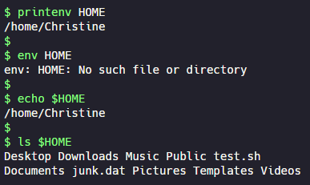
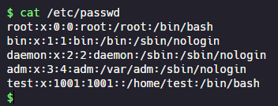

1. 通过关键字搜索手册页

   `man -k 关键字`

   例：`man -k hostname`

   

   - 后面的数字表示手册来自哪块内容

     例：查看指定命令第一部分的内容

     输入 `man 1 hostname` 就可以查看具体的内容
   
2. `ls -F`

   在没安装彩色终端仿真器时，该命令可以区分文件和目录

   

   - 目录名后面会添加正斜线`/`
   - 可执行文件后面会添加`*`
   
3. `ls -R`

   递归显示当前目录下包含的子目录中的文件。如果目录很多，这个输出就会很长
   
4. `file file_name`

   查看文件的类型
   
5. `cat -n file_name`

   给所有的行加上行号

   
   
6. `cat -b file_name`

   给有文本的行加上行号

   
   
7. `head file_name`

   显示文件开头多少行的内容。默认情况下显示10行。

   与`tail`参数类似
   
8. `top`命令显示实时的进程信息

   

   第一行显示了当前时间、系统的运行时间、登录的用户数以及系统的平均负载

   平均负载有3个值：最近1分钟的、最近5分钟的和最近15分钟的平均负载

   > 值越大说明系统的负载越高。如果近15分钟内的平均负载都很高，就说明系统可能有问题
   > 通常，如果系统的负载值超过了2，就说明系统比较繁忙了
   
9. `df`查看所有已挂载磁盘的使用情况

   有可能系统上有运行的进程已经创建或删除了某个文件，但尚未释放文件。这个值是不会算进闲置空间的
   
10. 默认情况下， `du`命令会显示当前目录下所有的文件、目录和子目录的磁盘使用情况

11. `grep -v`搜索不包含指定模式的行

    例：`grep -v t file1` 搜索`file1`中不包含`t`的行

    
    
12. `grep -n`显示匹配到的行的行号

    例：`grep -n t file1`

    
    
13. `grep -e`搜索时匹配多个模式

    例：`grep -e t -e f file1`搜索含有字符 t 或字符 f 的所有行

    
    
14. `tar function [options] object1 object2 ...` 对数据进行归档

    - function

      - `-c` --create 

        创建一个新的tar归档文件
      
      - `-x` --extract 
    
        从已有tar归档文件中提取文件
      
      - `-t` --list 
    
        列出已有tar归档文件的内容

    - options

      - `-f` file
      
        输出结果到文件或设备
      
      - `-v`
      
        在处理文件时显示文件
        
      - `-z` 
      
        将输出重定向给gzip命令来解压/压缩内容
    
    例：
    
    - `tar -cvf test.tar test/ test2/`
    
      创建了名为test.tar的归档文件，含有test和test2目录内容
    
    - `tar -tf test.tar`
    
      列出tar文件test.tar的内容（但并不提取文件）
    
    - `tar -xvf test.tar`

        从tar文件test.tar中提取内容。如果tar文件是从一个目录结构创建的，那整个目录结构都会在当前目录下重新创建

    - `tar -zxvf filename.tgz`

      解压gzip压缩过的tar文件

      > gzip压缩过的tar文件以.tgz结尾
    
15. 使用`env`或`printenv`命令查看全部环境变量

16. 显示个别环境变量的值，可以使用`printenv`命令或者`echo env_name`命令

    

    > `env`命令不能查看单个环境变量的值

    > 在echo命令中，在变量名前加上`$`不但可以显示变量当前的值，还能够让变量作为命令行参数

17. 设置变量时，变量名、等号和值之间没有空格

    

18. 删除环境变量

    

    > 不要使用`$`

19. 什么时候该使用`$`来引用环境变量

    如果要用到变量，使用`$` ；如果要操作变量，不使用`$` 。

    这条规则的一个例外就是使用`printenv`显示某个变量的值

20. 定位系统环境变量

    在登入Linux系统启动一个bash shell时，默认情况下bash会在启动文件中查找命令。bash检查的启动文件取决于启动bash shell的方式。

    启动bashshell有3种方式：

    - 登录时作为默认登录shell

      登录shell会从5个不同的启动文件里读取命令：

      - `/etc/profile`

        该文件是系统上默认的bash shell的主启动文件。系统上的每个用户登录时都会执行这个启动文件。

        会去读取`/etc/profile.d`目录下的所有文件，并执行这些文件

        > 在Ubuntu系统中，会去执行`/etc/bash.bashrc`文件。这个文件包含了系统环境变量

      shell会按照按照下列顺序，运行第一个被找到的文件，余下的则被忽略

      > `$HOME/.bashrc`文件通常通过其他文件运行的

      - `$HOME/.bash_profile`
      - `$HOME/.bash_login`
      - `$HOME/.profile`
      - `$HOME/.bashrc`

    - 作为非登录shell的交互式shell（在命令行提示符下敲入bash时启动）

      只会检查用户`HOME`目录中的`.bashrc`文件

    - 作为运行脚本的非交互shell（系统执行shell脚本时）

      - 检查环境变量`BASH_ENV`是否有指定的执行文件
      - 使用当前shell的局部变量和全局变量
    
21. 环境变量持久化

    - 全局环境变量

      在`/etc/profile.d`目录中创建一个以`.sh`结尾的文件。把所有新的或修改过的全局环境变量设置放在这个文件中

    - 用户环境变量

      存储个人用户永久性shell变量的地方是`$HOME/.bashrc`文件

22. `/etc/passwd`文件

    

    字段包含了如下信息：

    - 登录用户名
    - 用户密码
    - 用户账户的UID（数字形式）
    - 用户账户的组ID（GID）（数字形式）
    - 用户账户的文本描述（称为备注字段）
    - 用户`HOME`目录的位置
    - 用户的默认shell

    `root`用户账户是Linux系统的管理员，固定分配给它的`UID`是`0`

    Linux为系统账户预留了`500以下`的UID值

    密码字段都被设置成了`x`

    > 用户密码保存在另一个单独的文件`/etc/shadow`中，只有特定的程序（比如登录程序）才能访问这个文件

23. 添加新用户

    `useradd -m username`

    - `-m` 创建用户的`HOME`目录

      系统会将`/etc/skel`目录下的内容复制到用户的`HOME`目录下

    - `-g` 指定用户登录组的GID或组名

24. 删除用户

    - `userdel username` 

      删除`/etc/passwd`文件中的用户信息，但是不会删除属于该账户的任何文件

    - `userdel -r username`

      会删除用户的`HOME`目录以及邮件目录

      > 慎用，因为有可能其他程序要使用的文件在`HOME`目录

25. 修改用户

    - `usermod -L username` 锁定账户，使用户无法登录

    - `usermod -U username` 解除锁定，使用户能够登录

    - `usermod -G group_name username` 将指定用户添加到指定组

      > 用户必须重新登录，组关系的更改才能生效

    - `passwd [username]`

      如果只用`passwd`命令，它会改你自己的密码。系统上的任何用户都能改自己的密码，但只有`root`用户才有权限改别人的密码

26. 创建新组

    `groupadd group_name`

    创建新组时，默认没有用户被分配到该组

    > `groupadd`没有提供将用户添加组中的选项

27. 用`yum`卸载软件

    - `yum remove package_name` 只删除软件包而保留配置文件和数据文件
    - `yum erase package_name` 删除软件和它所有的文件

28. 从源码安装步骤

    - `tar`解压
    - `./configure`
    - `make`
    - `make install`

29. vim基础

    - `G`：移到缓冲区的最后一行
    
    - `num G`：移动到缓冲区中的第`num`行

    - `gg`：移到缓冲区的第一行

    - `w filename`：将文件保存到另一个文件中

    - 编辑数据
    
      - `dd`：删除当前光标所在行
      - `d$`：删除当前光标所在位置至行尾的内容
      - `J`：删除当前光标所在行行尾的换行符（拼接行）
      - `u`：撤销前一编辑命令
      - `A`：在当前光标所在行行尾追加数据
      - `num dd`：删除从光标当前所在行开始的`num`行

    - 剪切

      从缓冲区中删除的数据，实际上会保存在一个单独的寄存器中，可以使用`p`命令取回数据

    - 复制
    
      - `y$`：复制到行尾。在光标所在处，使用`p`命令可以进行粘贴
      - 移动光标到要开始复制的位置，按下`v`键，移动光标会高亮要复制的文本，然后按下`y`键完成复制。移动光标到需要粘贴的位置，按下`p`键进行粘贴
    
    - 替换
    
      - 替换一个
    
        `:s/old/new/`
    
      - 替换一行中所有的old
    
        ` :s/old/new/g`
    
      - 替换行号 n 和 m 之间所有 old
    
        ` :n,ms/old/new/g`
    
      - 替换整个文件中的所有 old 
    
        `:%s/old/new/g`
    
      - 替换整个文件中的所有 old ，但在每次出现时提示
    
        `:%s/old/new/gc`
    
30. 创建shell脚本

    在创建shell脚本文件时，必须在文件的第一行指定要使用的shell，其格式为：`#!/bin/bash`

    > `#`后面的`!`表示使用哪个shell来运行脚本

    - `echo`

      - 默认情况下，不需要使用引号将要显示的文本字符串括起来

        但是如果字符串本身有单引号或双引号，则需要使用双引号或单引号括起来

      -  `-n`     do not output the trailing newline

        不进行换行输出

      -  `echo`命令中的环境变量会在脚本运行时替换成当前值

        即使是在双引号中使用

        例：

        

        如果要显示`$`，需要添加反斜杆`\`

        

    - `set`

      显示一份完整的当前环境变量列表

31. 用户变量

    - 用户变量区分大小写

    - 在变量、等号和值之间不能出现空格

    - 引用一个变量值时需要使用美元符

      

      > 没有美元符，shell会将变量名解释成普通的文本字符串

32. 命令替换

    将命令输出赋值给变量的两种方法为：

    - 反引号字符`` ` ``
    - `$()`格式

    

33. 退出脚本

    - 查看退出状态码

      通过专门的变量`$?`来保存上个已执行命令的退出状态码

      > 按照惯例，一个成功结束的命令的退出状态码是 0

    - `exit`命令

      `exit`命令可以提前退出，并指定一个退出状态码

34.  if-then语句

    ```bash
    if command
    then
    	commands
    fi
    ```

    如果`if`后面的命令执行成功（退出状态码为0），则会执行`then`部分的命令，否则不会执行

    

35. `if-then-else`语句

    ```bash
    if  command
    then
    	commands
    else
    	commands
    fi
    ```

    当 if 语句中的命令返回退出状态码 0 时， then 部分中的命令会被执行。当 if 语句中的命令返回非零退出状态码时，bash shell会执行 else 部分中的命令

36. 嵌套`if`

    ```bash
    if  command1
    then
    	commands
    elif  command2
    then
    	commands
    else 
    	commands
    fi
    ```

    > 在 elif 语句中，紧跟其后的 else 语句属于 elif 代码块。它们并不属于之前的if-then 代码块

37. `test`命令

    `test condition`

    如果 test 命令中列出的条件成立，test 命令就会退出并返回退出状态码 0

    > 如果不写 `test` 命令的 `condition` 部分，它会以非零的退出状态码退出

    

    bash shell提供了另一种条件测试方法，无需在 `if-then` 语句中声明 `test` 命令：

    ```bash
    if [ condition ]
    then
    	commands
    fi
    ```

    > 第一个方括号之后和第二个方括号之前必须加上一个空格，否则就会报错

    `test`命令可以判断三类条件：

    - 数值比较

      

      > bash shell只能处理整数，所以不能在test命令中使用浮点值

    - 字符串比较

      

      > 在比较时，`>`、`<`需要加转义符`\`
    
    - 文件比较
    
      
    
38. 创建符号链接

    `ln –s item link`

    item可以是文件也可以是目录

    ```bash
    $ ln -s fun fun-sym
    $ ls -l
    lrwxrwxrwx 1 root root 3 Jun 10 15:23 fun-sym -> fun
    ```

39. 显示可执行程序的位置

    `which`

    ```bash
    $ which ls
    /bin/ls
    ```

    > which命令只适用于可执行程序，而不适用于内置命令和命令别名

40. 显示命令的类型

    `type command`

    ```bash
    $ type cp
    cp is /bin/cp
    ```

41. 创建命令的别名

    `alias name='string'`

    ```bash
    $ alias foo='cd /usr; ls; cd -'
    $ foo
    bin  games  include  lib  libexec  local  sbin  share  src
    /home/root
    ```

42. 清空一个已存在的文件内容或者创建一个新的空文件

    `> file_name`

43. 标准文件描述符

    Linux系统将每个对象当作文件处理。这包括输入和输出进程。Linux用文件描述符来标识每个文件对象。文件描述符是一个非负整数，可以唯一标识会话中打开的文件。每个进程一次最多可以有九个文件描述符。bash shell保留了前三个文件描述符

    

    - `0`

      代表shell的标准输入。对终端界面来说，标准输入是键盘

    - `1`

      代表shell的标准输出。在终端界面上，标准输出就是终端显示器。shell的所有输出（包括shell中运行的程序和脚本）会被定向到标准输出中

    - `2`

      代表shell的标准错误输出。默认情况下，`STDERR`文件描述符会和`STDOUT`文件描述符指向同样的地方。也就是说，默认情况下，错误消息也会输出到显示器中。但是`STDERR`并不会随着`STDOUT`的重定向而发生改变

44. 只重定向错误

    将`STDERR`文件描述符放在重定向符号前。

    > 该值必须与重定向符号之间不能有空格

    ```bash
    $ ls -al test badtest test2 2> test5
    -rw-rw-r-- 1 rich rich 158 2014-10-16 11:32 test2
    $
    $ cat test5
    ls: cannot access test: No such file or directory
    ls: cannot access badtest: No such file or directory
    $
    ```

    错误消息不会出现在屏幕上了，但是标准输出依然会显示在屏幕上

45. 重定向错误和数据

    要重定向错误和正常输出，需要使用两个重定向符号

    ```bash
    $ ls -al test test2 test3 badtest 2> test6 1> test7
    $ cat test6
    ls: cannot access test: No such file or directory
    ls: cannot access badtest: No such file or directory
    $ cat test7
    -rw-rw-r-- 1 rich rich 158 2014-10-16 11:32 test2
    -rw-rw-r-- 1 rich rich 0 2014-10-16 11:33 test3
    $
    ```

    将`STDERR`和`STDOUT`的输出重定向到同一个输出文件，可以使用特殊的重定向符号`&>`

    ```bash
    $ ls -al test test2 test3 badtest &> test7
    $ cat test7
    ls: cannot access test: No such file or directory
    ls: cannot access badtest: No such file or directory
    -rw-rw-r-- 1 rich rich 158 2014-10-16 11:32 test2
    -rw-rw-r-- 1 rich rich 0 2014-10-16 11:33 test3
    $
    ```

46. 临时重定向

    将单独的一行输出重定向到`STDERR`时，需要使用输出重定向符来将输出信息重定向到`STDERR`文件描述符

    > 在重定向到文件描述符时，必须在文件描述符数字之前加一个`& `

    ```bash
    $ cat test8
    #!/bin/bash
    echo "This is an error" >&2
    echo "This is normal output"
    $
    ```

    如果仅仅只是运行这个脚本，看不出什么区别

    ```bash
    $ ./test8
    This is an error
    This is normal output
    $
    ```

    但如果在运行脚本时重定向了`STDERR`，脚本中所有导向`STDERR`的文本都会被重定向

    ```bash
    $ ./test8 2> test9
    This is normal output
    $ cat test9
    This is an error
    $
    ```

47. 永久重定向

    ```bash
    $ cat test11
    #!/bin/bash
    # 后续STDERROR都将重定向到testerror
    exec 2>testerror
    
    echo "This is the start of the script"
    echo "now redirecting all output to another location"
    
    # 后续STDOUT都将重定向到testerror
    exec 1>testout
    echo "This output should go to the testout file"
    
    # 仍然可以手动将STDOUT的输出发给STDERROR
    echo "but this should go to the testerror file" >&2
    $
    $ ./test11
    This is the start of the script
    now redirecting all output to another location
    $
    $ cat testout
    This output should go to the testout file
    $
    $ cat testerror
    but this should go to the testerror file
    $
    ```

48. 阻止命令输出

    ```bash
    # 将不会有任何输出
    $ ls -al > /dev/null
    $
    # 错误消息将不会输出
    $ ls -al badfile testfile 2> /dev/null
    $
    # testfile中的内容将会被清空
    $ cat /dev/null > testfile
    ```

    


