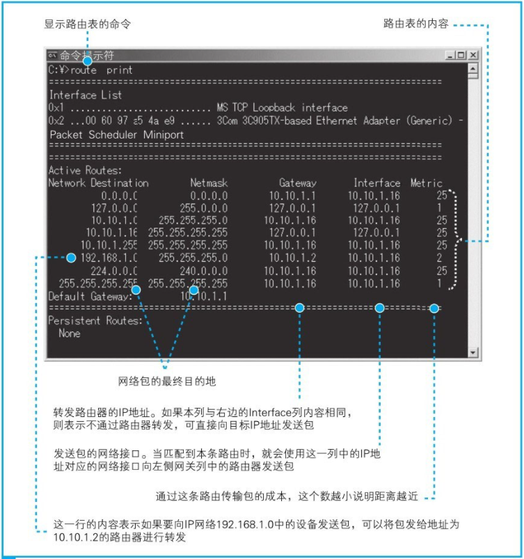
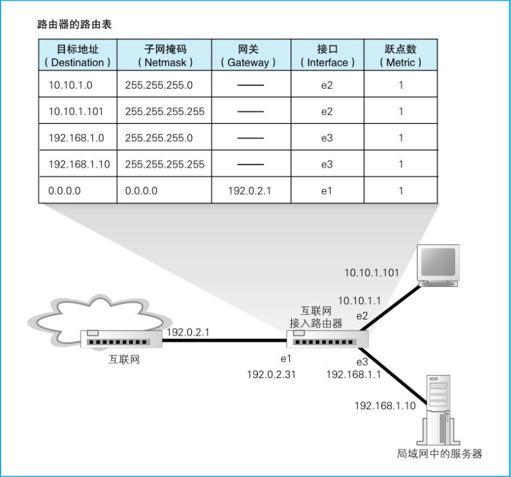

> 《网络是怎样连接的》读书笔记

* TOC
{:toc}
## 1.1 生成HTTP请求消息

### 1.1.2 浏览器先要解析URL

### 1.1.3 省略文件名的情况

- `http://www.lab.glasscom.com/dir/`

  以`/`结尾代表`/dir/`后面本来应该有的文件名被省略了

  需要在服务器上事先设置好文件名省略时要访问的默认文件名，一般为`index.html`

- `http://www.lab.glasscom.com/`

  它表示访问一个名叫`/`的目录

  由于省略了文件名，所以访问默认的文件

  > `/`表示根目录

- `http://www.lab.glasscom.com`

  当没有路径名时，就代表访问根目录下事先设置的默认文件

- `http://www.lab.glasscom.com/whatisthis`

  - 如果Web服务器上存在名为`whatisthis`的文件，则将`whatisthis`作为文件名来处理

  - 如果存在名为`whatisthis`的目录，则将`whatisthis`作为目录名来处理

  > 我们无法创建两个名字相同的文件和目录

### 1.1.4 HTTP的基本思路

解析完URL之后，就知道要访问的目标在哪里，接下来，浏览器会使用HTTP协议来访问Web服务器

HTTP协议定义了客户端和服务器之间交互的消息内容和步骤：

1. 客户端会向服务器发送请求消息

   - 请求消息中包含的内容是“对什么”和“进行怎样的操作”两个部分
     - “对什么”的部分称为URI
     - “进行怎样的操作”的部分称为方法
   - 还包含用来表示附加信息（可有可无）的头字段

2. 收到请求消息之后，Web服务器会对其中的内容进行解析，将处理结果存放在响应消息中

   在响应消息的开头有一个状态码，它用来表示操作的执行结果是成功还是发生了错误


### 1.1.5 生成HTTP请求消息

对URL进行解析之后，浏览器确定了Web服务器和文件名，然后根据这些信息来生成HTTP请求消息

浏览器会按照规定的格式来生成请求消息：

- 请求消息的第一行称为请求行，包括

  - 方法
  - URI
  - HTTP的版本号

- 第二行开始为消息头

  消息头中的内容随着浏览器类型、版本号、设置等的不同而不同，大多数情况下消息头的长度为几行到十几行不等

- 写完消息头之后，添加一个完全没有内容的空行

- 最后写上消息体

  消息体就是需要发送的数据

  - 在使用GET方法的情况下，仅凭方法和URI, Web服务器就能够判断需要进行怎样的操作，因此消息体中不需要填写任何数据
  - 当使用POST方法时，需要将表单中填写的信息写在消息体中


### 1.1.6 发送请求后会收到响应

- 响应消息的格式以及基本思路和请求消息是相同的，差别只在第一行上

- 第一行的内容为状态码和响应短语

  用来表示请求的执行结果是成功还是出错


## 1.2 向DNS服务器查询Web服务器的IP地址

### 1.2.1 IP地址的基本知识

生成HTTP消息之后，接下来我们需要委托操作系统将消息发送给Web服务器。在委托操作系统发送消息时，必须要提供的不是通信对象的域名，而是它的IP地址

TCP/IP的基本思路：

- 用集线器连接起来的计算机可以看作一个**子网**
- 子网再通过路由器组成一个大的网络
- 所有的设备都会被分配一个IP地址，包含两部分
  - 网络号 - 分配给整个子网
  - 主机号 - 分配给子网中的计算机


IP地址是一串32比特的数字，按照8比特（1字节）为一组分成4组，分别用十进制表示然后再用圆点隔开

> 但仅凭这一串数字我们无法区分哪部分是网络号，哪部分是主机号
>
> 这两部分的具体结构是不固定的。在组建网络时，用户可以自行决定它们之间的分配关系
>
> 因此，还需要另外的附加信息来表示IP地址的内部结构，这一附加信息称为**子网掩码**
>
> 子网掩码表示网络号与主机号之间的边界

子网掩码是一串与IP地址长度相同的32比特数字，其左边一半都是1，右边一半都是0

- 为1的部分表示网络号
- 为0的部分表示主机号

IP地址的主机号

- 全0：表示整个子网
- 全1：表示向子网上所有设备发送包，即“广播”


### 1.2.2 域名和IP地址并用的理由

- TCP/IP网络是通过IP地址来确定通信对象
- 要记住一串由数字组成的IP地址非常困难，相比IP地址来说，网址中使用服务器名称比较好记
- IP地址的长度为32比特，也就是4字节。域名最长可以达到255字节。这增加了路由器的负担，传送数据也会花费更长的时间
- 域名长度不固定，处理长度不固定的数据比处理长度固定的数据更复杂

### 1.2.3 Socket库提供查询IP地址的功能

DNS解析器通过DNS查询IP地址的操作称为域名解析

解析器实际上是一段程序，它包含在操作系统的Socket库中

Socket库是一种标准库，其中包含的程序组件可以让其他的应用程序调用操作系统的网络功能

### 1.2.5 解析器的内部原理

解析器根据DNS的规格，生成一条数据，委托给操作系统内部的协议栈来执行发送消息的操作，然后通过网卡将消息发送给DNS服务器

DNS服务器将IP地址写入响应消息并返回给客户端，再经过协议栈被传递给解析器，然后解析器读取出消息中IP地址，写入应用程序指定的内存地址中

> 协议栈：操作系统内部的网络控制软件

> 向DNS服务器发送消息时，DNS服务器的IP地址是作为TCP/IP的一个设置项目事先设置好的，不需要再去查询

## 1.3 全世界DNS服务器的大接力

### 1.3.1 DNS服务器的基本工作

客户端查询DNS服务器包含以下3种信息：

- 域名

- Class

  Class的值永远是代表互联网的IN

- 记录类型

  表示域名对应何种类型的记录

  > 当类型为A时，表示域名对应的是IP地址
  >
  > 当类型为MX时，表示域名对应的是邮件服务器


### 1.3.2 域名的层次结构

DNS服务器中的所有信息都是按照域名以分层次的结构来保存的

DNS中的域名都是用句点来分隔的，在域名中，越靠右的位置表示其层级越高

一个域的信息是作为一个整体存放在DNS服务器中的，一台DNS服务器中也可以存放多个域的信息

### 1.3.3 寻找相应的DNS服务器并获取IP地址

- 将负责管理下级域的DNS服务器的IP地址注册到它们的上级DNS服务器中，然后上级DNS服务器的IP地址再注册到更上一级的DNS服务器中，以此类推

- 将根域的DNS服务器信息保存在互联网中所有的DNS服务器中

> 域名的最后再加上一个句点，这个最后的句点就代表根域。一般书写域名时被省略
>
> 分配给根域DNS服务器的IP地址在全世界仅有13个


### 1.3.4 通过缓存加快DNS服务器的响应

上级域和下级域有可能共享同一台DNS服务器，访问上级DNS服务器时就可以直接返回再下一级DNS服务器的相关信息

DNS服务器有一个缓存功能，可以缓存之前查询过的域名，并且会设置一个有效期

> 当要查询的域名不存在时，“不存在”这一响应结果也会被缓存

在对查询进行响应时，DNS服务器会告知客户端响应的结果是来自缓存还是来自负责管理该域名的DNS服务器

## 1.4 委托协议栈发送消息

### 1.4.1 数据收发操作概览

知道IP地址之后，就可以委托操作系统内部的协议栈向这个目标IP地址发送消息了

在进行收发数据操作之前，双方需要先建立起一起管道才行，而这条管道的关键在于管道两端的数据出入口，这些出入口称为**套接字**

要先创建套接字，然后再将套接字连接起来形成管道

- 首先，服务器一方先创建套接字，然后等待客户端向该套接字连接管道

  > 服务器程序一般在启动后就创建号套接字并等待客户端连接管道

- 客户端创建一个套接字，然后连接到服务器端的套接字上

- 当双方的套接字连接起来后，通信准备就完成了，接下来就可以收发数据了

- 当数据全部发送完毕之后，连接的管道将会被断开，套接字也会被删除

  > 断开操作可以由客户端或服务器任意一方发起

这些操作都是由操作系统中的协议栈来执行的

### 1.4.2 创建套接字阶段

客户端通过调用Socket库中的socket程序组件委托协议栈来创建套接字

- 套接字创建完成后，协议栈会返回一个**描述符**，应用程序会将收到的描述符存放在内存中

  > 描述符是用来识别不同的套接字的

### 1.4.3 连接阶段：把管道接上去

应用程序通过调用Socket库中的connect程序组件委托协议栈来进行连接

调用connect时，需要指定描述符、服务器IP地址和端口号这3个参数：

- 描述符

  协议栈根据这个描述符来判断到底使用哪一个套接字去和服务器端的套接字进行连接，并执行连接的操作

- 服务器IP地址

- 端口号

  通过IP地址，可以识别出网络上的某台计算机。通过就可以识别出某台计算机上的某个具体的套接字

  > 服务器上所使用的端口号是根据应用的种类事先规定好的
  >
  > 比如：web是80号端口，电子邮件是25号端口

  > 客户端在创建套接字时，协议栈会为这个套接字随机分配一个端口号。当协议栈执行连接操作时，会将这个端口号通知给服务器

当调用connect时，协议栈执行连接操作。连接成功后，协议栈会将对方的IP地址和端口号等信息保存在套接字中

### 1.4.4 通信阶段：传递消息

应用程序通过Socket库中的write程序组件委托协议栈来发送数据

调用write时，需要指定描述符和发送数据

服务器执行接收操作，解析收到的数据并执行相应的操作，向客户端返回响应消息

---

应用程序通过Socket库中的read程序组件委托协议栈来接收消息

调用read时需要指定用于存放接收到的响应消息的内存地址，也称为**接收缓冲区**，这是一块位于应用程序内部的内存空间

read会将接收到的响应消息存放到接收缓冲区中

### 1.4.5 断开阶段：收发数据结束

应用程序通过调用Socket库的close程序组件委托协议栈来断开连接

在HTTP 1.0协议中，当web服务器发送完响应消息之后，应主动执行断开操作，当断开操作传达到客户端之后，客户端的套接字也会进入断开阶段

在HTTP 1.1协议中，能够在一次连接中收发多个请求和响应，在这种情况下，当所有数据都请求完成后，浏览器会主动触发断开连接的操作

## 2.1 创建套接字

### 2.1.1 协议栈的内部结构


上层会向下层逐层委派工作

> 像浏览器、邮件等一般的应用程序都是使用TCP收发数据的
>
> 像DNS查询等收发较短的控制数据的时候则使用UDP

网卡驱动程序负责控制网卡硬件

网卡则负责完成实际的收发操作，也就是对网线中的信号执行发送和接收的操作

### 2.1.2 套接字的实体就是通信控制信息

协议栈内部有一块存放控制信息的内存空间，用于控制通信操作的控制信息，例如通信对象的IP地址、端口号、通信操作的进行状态等

这些控制信息就是套接字的实体，或者说存放控制信息的内存空间就是套接字的实体

### 2.1.3 调用socket时的操作

应用程序调用socket申请创建套接字，协议栈首先分配一个套接字所需的内存空间，然后向其中写入初始状态的控制信息

## 2.2 连接服务器

### 2.2.2 负责保存控制信息的头部

控制信息分为两类：

- 一类是客户端和服务器相互联络时交换的控制信息

  

- 一类是保存在套接字中，用来控制协议栈操作的信息

### 2.2.3 连接操作的实际过程

- 应用程序调用Socket库的connect组件

  > connect(<描述符>, <服务器IP地址和端口号>, ...)

  服务器的IP地址和端口号会传递给协议栈中的TCP模块

- TCP模块会与服务器的TCP模块交换控制信息

  - 客户端先创建一个包含表示开始数据收发操作的控制信息的头部

    > 会包含发送方和接收方的端口号

  - 将头部中控制位的`SYN比特`设置为1，表示连接

    还需设置适当的序号和窗口大小

  - TCP模块会将信息传递给IP模块并委托它发送给服务器

  ---

  - 服务器上的IP模块会将接收到的数据传递给TCP模块

  - 服务器的TCP模块根据TCP头部中的信息找到端口号对应的套接字

  - 找到对应的套接字之后，套接字中会写入相应的信息，并将状态改为正在连接

  - 服务器的TCP模块在TCP头部中设置发送方和接收方端口号以及`SYN比特`

    此外还需将`ACK控制位`设为1，表示已经接收到相应的网络包

  - 服务器TCP模块会将TCP头部传递给IP模块，并委托IP模块向客户端返回响应

  ---

  - 客户端的IP模块将数据传递给TCP模块

  - TCP模块通过TCP头部的信息确认连接服务器的操作是否成功

    如果SYN为1则表示连接成功，并将状态改为连接完毕

  - 客户端将`ACK控制位`设为1并发给服务器，告诉服务器刚才的响应包已经收到

  - 当服务器收到这个返回包之后，连接操作才算全部完成，随时可以收发数据

## 2.3 收发数据

### 2.3.1 将HTTP请求消息交给协议栈

应用程序调用write将要发送的数据交给协议栈，协议栈收到数据后执行发送操作

协议栈并不是一收到数据就马上发送出去，而是会将数据存放在内部的`发送缓冲区`中，并等待应用程序的下一段数据

> 一次将多少数据交给协议栈是由应用程序自行决定的，协议栈并不能控制这一行为
>
> 如果一收到数据就马上发送出去，就可能会发送大量的小包，导致网络效率下降，因此需要在数据积累到一定量时再发送出去

通过如下要素判断何时进行数据的发送：

- 一个判断要素是每个网络包能容纳的数据长度

  协议栈通过`MTU`减去头部的长度，得到就是一个网络包中所能容纳的最大数据长度，即`MSS`

  当从应用程序收到的数据长度超过或者接近MSS时再发送出去

  > MTU：一个网络包的最大长度，包含头部，以太网中一般为1500字节
  >
  > MSS：除去头部之后，一个网络包所能容纳的TCP数据的最大长度

- 另一个判断要素是时间

  当应用程序发送数据的频率不高时，如果每次都等到长度接近MSS时再发送，可能会因为等待时间太长而造成发送延迟

  协议栈的内部有一个计时器，当经过一定时间之后，就会把网络包发送出去

如果长度优先，那么网络的效率会提高，但可能会因为等待填满缓冲区而产生延迟

如果时间优先，那么延迟时间会变少，但又会降低网络的效率

在进行发送操作时需要综合判断这两个要素以达到平衡，实际如何判断是由协议栈的开发者来决定的，所以不同的操作系统也就存在差异

因此协议栈给应用程序保留了一些选项用于控制发送时机


> 起始帧分界符：Start Frame Delimiter，SFD
>
> FCS：Frame Check Sequence，帧校验序列

### 2.3.2 对较大的数据进行拆分

当发送缓冲区中的数据超过MSS的长度，发送缓冲区中的数据会被以MSS长度为单位进行拆分，拆分出来的每块数据会被放进单独的网络包中


### 2.3.3 使用ACK号确认网络包已收到

TCP具备确认对方是否成功收到网络包，以及当对方没收到时进行重发的功能，因此在发送网络包之后，还需要进行确认操作

- 首先，TCP模块在拆分数据时，会先算好每一块数据相当于从头开始的第几个字节，将算好的字节数写入TCP头部中**序号**字段

- 如果数据没有遗漏，接收方会将到目前为止接收到的数据长度加起来，计算出一共已经收到了多少个字节，然后将这个数值写入TCP头部的ACK号中发送给发送方

  还需要将`ACK控制位`设为1，表示ACK字段有效，接收方就可以知道这个网络包是用来告知ACK号的

  > 例如，假设上次接收到第1460字节，那么接下来如果收到序号为1461的包，说明中间没有遗漏；但如果收到的包序号为2921，那就说明中间有包遗漏了

- 发送方通过返回的ACK号就能够确认对方到底收到了多少数据


在实际的通信中需要用随机数计算出一个序号初始值，因此需要在开始收发数据之前将初始值告知通信对象

在将`SYN控制位`设为1的同时，还需要设置序号字段的初始值

> 如果序号都从1开始，通信过程就会非常容易预测

TCP实际的工作过程：

- 客户端在连接时计算出自己的序号初始值，并将这个值发送给服务器

- 服务器会通过这个初始值计算出ACK号并返回给客户端。同时，服务器计算出自己的序号初始值，并将这个值发送给客户端

  > 初始值有可能在通信过程中丢失，因此当服务器收到初始值后需要返回ACK号作为确认

- 客户端向服务器发送请求，序号也会跟随数据一起发送

- 服务器收到数据后再返回ACK号

- 服务器向客户端发送数据的过程则正好相反


TCP采用这样的方式确认对方是否收到了数据，在得到对方确认之前，发送过的包都会保存在发送缓冲区中。如果对方没有返回某些包对应的ACK号，那么就重新发送这些包

### 2.3.4 根据网络包平均往返时间调整ACK号等待时间

当网络传输繁忙时就会发生拥塞，ACK号的返回会变慢，这时就必须将等待时间设置得稍微长一点，否则可能会发生已经重传了包之后，前面的ACK号才姗姗来迟的情况

TCP会在发送数据的过程中持续测量ACK号的返回时间，如果ACK号返回变慢，则相应延长等待时间；相对地，如果ACK号马上就能返回，则相应缩短等待时间

> 由于计算机的时间测量精度较低，ACK返回时间过短时无法被正确测量，因此等待时间有一个最小值，这个值在每个操作系统上不一样，基本上是在0.5秒到1秒之间

### 2.3.5 使用窗口有效管理ACK号

每发送一个包就等待一个ACK号，在等待ACK号的这段时间中，如果什么都不做那就太浪费了

所以TCP采用滑动窗口的方式来管理数据发送和ACK号的操作

> 滑动窗口：就是在发送一个包之后，不等待ACK号返回，而是直接发送后续的一系列包

> 但如果不等返回ACK号就连续发送包，就有可能会出现发送包的频率超过接收方处理能力的情况

滑动窗口的具体工作方式：

- 接收方将数据暂存到接收缓冲区中并执行接收操作
- 当接收操作完成后，接收缓冲区中的空间会被释放出来
- 接收方会通过TCP头部中的**窗口**字段将自己能接收的数据量告知发送方
- 这样一来，发送方就不会发送过多的数据，导致超出接收方的处理能力了

> 接收方能够接收的最大数据量称为窗口大小，它是重要的TCP调优参数
>
> 窗口大小一般和接收方的缓冲区大小一致

### 2.3.6 ACK与窗口的合并

当接收方将数据传递给应用程序，导致接收缓冲区剩余容量增加时，就需要告知发送方，这就是更新窗口大小的时机

当接收方收到数据时，如果确认内容没有问题，就应该向发送方返回ACK号，因此收到数据之后马上就应该进行这一操作

但如果根据这样的设计来实现，每收到一个包，就需要向发送方分别发送ACK号和窗口更新这两个单独的包。这样一来，接收方发给发送方的包就太多了，导致网络效率下降

因此，接收方在发送ACK号和窗口更新时，并不会马上把包发送出去，而是会等待一段时间，在这个过程中很有可能会出现其他的通知操作，这样就可以把两种通知合并在一个包里面发送了

> 例如：
>
> - 在等待发送ACK号的时候正好需要更新窗口，这时就可以把ACK号和窗口更新放在一个包里发送，从而减少包的数量
>
> - 当需要连续发送多个ACK号时，也可以减少包的数量
>
>   因为ACK号表示的是已收到的数据量，也就是说，它是告诉发送方目前已接收的数据的最后位置在哪里，因此当需要连续发送ACK号时，只要发送最后一个ACK号就可以了，中间的可以全部省略
>
> - 当需要连续发送多个窗口更新时也可以减少包的数量
>
>   因为连续发生窗口更新说明应用程序连续请求了数据，接收缓冲区的剩余空间连续增加。这种情况和ACK号一样，可以省略中间过程，只要发送最终的结果就可以了

### 2.3.7 接收HTTP响应消息

协议栈将数据块暂存到接收缓冲区中，并将数据块按顺序连接起来还原出原始的数据，最后将接收到的数据复制到应用程序指定的内存地址中

## 2.4 从服务器断开并删除套接字

### 2.4.1 数据发送完毕后断开连接

以Web为例，浏览器向Web服务器发送请求消息，Web服务器再返回响应消息，这时收发数据的过程就全部结束了，服务器一方会发起断开过程

> 在HTTP1.1中，服务器返回响应消息之后，客户端还可以继续发起下一个请求消息，如果接下来没有请求要发送了，客户端一方会发起断开过程

> 协议栈在设计上允许任何一方先发起断开过程

- 首先，服务器一方的应用程序会调用Socket库的close程序
- 然后，服务器的协议栈会生成包含断开信息的TCP头部，具体来说就是将控制位中的`FIN比特`设为1
- 协议栈会委托IP模块向客户端发送数据。同时，服务器的套接字中也会记录下断开操作的相关信息

---

- 当客户端收到服务器发来的消息，客户端的协议栈会将自己的套接字标记为进入断开操作状态
- 然后，客户端会向服务器返回一个ACK号，告知服务器已收到FIN为1的包
- 协议栈等待应用程序来取数据

---

- 应用程序调用read来读取数据时，协议栈不会向应用程序传递数据，而是会告知应用程序来自服务器的数据已经全部收到了

  如果接收缓冲区中还有剩余的已接收数据，则这些数据会被传递给应用程序

- 然后，客户端应用程序调用close来结束数据收发操作，生成一个FIN比特为1的TCP包，然后委托IP模块发送给服务器

- 服务器返回ACK号

- 客户端和服务器的通信就全部结束了

### 2.4.2 删除套接字

通信结束之后，用来通信的套接字会被删除。不过并不会立即被删除，而是会等待一段时间之后再被删除

具体等待多长时间，这和包重传的操作方式有关。协议中对于这个等待时间没有明确的规定，一般来说会等待几分钟之后再删除套接字

等待这段时间是为了防止误操作，比如：

客户端先发起断开，则断开的操作顺序如下：

1. 客户端发送FIN
2. 服务器返回ACK号
3. 服务器发送FIN
4. 客户端返回ACK号

如果最后客户端返回的ACK号丢失了，这时，服务器没有接收到ACK号，可能会重发一次FIN。如果这时客户端的套接字已经删除了，那么套接字中保存的控制信息也就跟着消失了，套接字对应的端口号就会被释放出来

如果别的应用程序要创建套接字，新套接字碰巧又被分配了同一个端口号，而服务器重发的FIN正好到达，那么新套接字就开始执行断开操作了

### 2.4.3 数据收发操作小结


## 2.5 IP与以太网的包收发操作

### 2.5.1 包的基本知识

包是由头部和数据两部分构成的。头部包含目的地址等控制信息


集线器是按照以太网规则传输包的设备，而路由器是按照IP规则传输包的设备

- IP协议根据目标地址判断下一个IP转发设备的位置
- 子网中的以太网协议将包传输到下一个转发设备

发送方将包的目的地，也就是要访问的服务器的IP地址写入IP头部中。IP协议就可以根据这一地址查找包的传输方向，从而找到下一个路由器的位置

接下来，IP协议会查找下一个路由器的以太网地址（MAC地址），并将这个地址写入MAC头部中。IP协议会委托以太网协议将包传输过去

网络包在传输过程中会经过集线器，集线器里有一张表，可根据以太网头部中记录的目的地信息查出相应的传输方向

接下来，包会到达下一个路由器。路由器中有一张IP协议的表，根据这张表以及IP头部中记录的目的地信息查出接下来应该发往哪个路由器。为了将包发到下一个路由器，还需查出下一个路由器的MAC地址，并改写了MAC头部。这样，网络包就又被发往下一个节点

不断重复这个过程，最终网络包就会被送到目的地


### 2.5.2 包收发操作概览

IP模块负责添加如下两个头部：

1. MAC头部：以太网用的头部，包含MAC地址
2. IP头部：IP用的头部，包含IP地址

### 2.5.3 生成包含接收方IP地址的IP头部


- IP头部的`接收方IP地址`填写通信对象的IP地址

- `发送方IP地址`需要通过路由表来判断应该把包交给哪块网卡，并填写该网卡的IP地址

通过`route print`命令来显示路由表：



目的IP地址与路由表中Network Destination列进行比较，找到对应的一行

- Interface列

  表示网卡等网络接口，这些网络接口可以将包发送给通信对象

- Gateway列

  表示下一个路由器的IP地址，将包发给这个IP地址，该地址对应的路由器就会将包转发到目标地址

- 路由表的第1行

  目标地址和子网掩码都是`0.0.0.0`，这表示默认网关，如果其他所有条目都无法匹配，就会自动匹配这一行

判断出应该使用哪块网卡来发送包之后，就可以在IP头部的发送方IP地址中填上这块网卡对应的IP地址

协议号表示包的内容是来自哪个模块：

- 如果是TCP模块委托的内容，则为06（十六进制）
- 如果是UDP模块委托的内容，则为17（十六进制）

### 2.5.4 生成以太网用的MAC头部


- 发送方MAC地址，即网卡本身的MAC地址

  实际上，只有在操作系统启动过程中对网卡进行初始化的时候才会读取MAC地址，读取出来之后会存放在内存中，每次执行收发操作时实际上使用的是内存中的值

  此外，读取MAC地址的操作是由网卡驱动程序来完成的，因此网卡区动程序也可以不从网卡ROM中读取地址，而是将配置文件中设定的MAC地址拿出来放到内存中并用于设定MAC头部，或者也可以通过命令输入MAC地址

  > 只读存储器（Read-Only Memory，ROM）

### 2.5.5 通过ARP查询目标路由器的MAC地址

> ARP：Address Resolution Protocol，地址解析协议

通过广播的方式，把包发给连接在同一以太网中的所有设备，如果对方和自己处于同一个子网中，那么就可以得到对方的MAC地址


> 如果路由表的设置正确，那么对方应该在同一子网，否则对方无法作出ARP响应，这时只能认为对方不存在，包的发送操作就会失败

查询结果会放到一块叫作ARP缓存的内存空间，当ARP缓存中不存在对方MAC地址时，则发送ARP查询

> ARP缓存中的值在经过一段时间后会被删除，一般这个时间在几分钟左右


### 2.5.7 将IP包转换成电或光信号发送出去

IP生成的网络包只是存放在内存中的一串数字信息，没有办法直接发送给对方。因此，需要网卡将数字信息转换为电或光信号，才能在网线上传输

网卡的ROM中保存着全世界唯一的MAC地址，这是在生产网卡时写入的，将这个值读出之后就可以对MAC模块进行设置了

> 有些网卡驱动程序提供可以通过命令或者配置文件中读取MAC地址并分配给MAC模块的功能

### 2.5.8 给网络包再加3个控制数据

网卡驱动从IP模块获取包之后，会将其复制到网卡内的缓冲区中，然后向MAC模块发送发送包的命令

MAC模块会将包从缓冲区中取出，并在开头加上报头和起始帧分界符（SFD），在末尾加上用于检测错误的帧校验序列（FCS）


- 报头用来测定时机

- SFD用来确定帧的起始位置

- FCS用来检查包传输过程中因噪声导致的波形紊乱、数据错误

  当原始数据中某一个比特发生变化时，计算出来的结果就会发生变化。在包传输过程中，如果受到噪声的干扰而导致其中的数据发生了变化，那么接收方计算出的FCS和发送方计算出的FCS就会不同，这样就可以判断出数据有没有错误

## 2.6 UDP协议的收发操作

TCP之所以设计得如此复杂，需要确认对方是否收到了我们发送的数据，如果没有还需要再发一遍

需要要避免重发已经送达的包，而是只重发那些出错的或者未送达的包

UDP协议没有其他的功能，遇到错误或者丢包也一概不管，因此出错时就收不到来自对方的回复，应用程序会注意到这个问题，并重新发送一遍数据

- 在数据很短的情况下，用一个包就能装得下

  如果只有一个包，就不用考虑哪个包未送达了，因为全部重发也只不过是重发一个包而已，这种情况下就不需要TCP这样复杂的机制

  发送了数据，对方一般都会给出回复，只要将回复的数据当作接收确认就行了，也不需要专门的接收确认包了

- 音频和视频数据

  在这些无需重发数据，或者是重发了也没什么意义的情况下，使用UDP发送数据的效率会更高


## 3.1 信号在网线和集线器中传输

网络包从客户端计算机发出之后，要经过集线器、交换机和路由器最终进入互联网

实际上，家用路由器已经集成了集线器和交换机的功能


局域网网线使用的是双绞线，其中“双绞”的意思就是以两根信号线为一组缠绕在一起，这种拧麻花一样的设计是为了抑制噪声的影响

当信号到达集线器后，会被广播到整个网络中，以太网的基本架构就是将包发到所有的设备，然后由设备根据接收方MAC地址来判断应该接收哪些包

当信号从网线接口流出，到达连接在集线器上的所有设备后，这些设备在收到信号之后会通过MAC头部中的接收方MAC地址判断是不是发给自己的，如果是发给自己的就接受，否则就忽略。这样，网络包就能够到达指定MAC地址的接收方了

## 3.2 交换机的包转发操作

### 3.2.1 交换机根据地址表进行转发

交换机的设计是将网络包原样转发到目的地

交换机的端口不核对接收方MAC地址，而是直接接收所有的包并存放到缓冲区中。因此交换机端口的MAC模块不具有MAC地址


### 3.2.2 MAC地址表的维护

- 收到包时，将发送方MAC地址以及其输入端口的号码写入MAC地址表中

  收到包的那个端口就连接着发送这个包的设备，所以只要将这个包的发送方MAC地址写入地址表，以后当收到发往这个地址的包时，交换机就可以将它转发到正确的端口了

  交换机每次收到包时都会执行这个操作，因此只要某个设备发送过网络包，它的MAC地址就会被记录到地址表中

- 删除地址表中某条记录的操作

  如果连接在某个端口上的设备移动过，交换机收到了发往这台已经消失的设备的包，那么它依然会将包转发到原来的端口，通信就会出错

  为了防止终端设备移动产生问题，会将一段时间不使用的过时记录从地址表中删除

### 3.2.3 特殊操作

- 当交换机发现一个包要发回到原端口时，就会直接丢弃这个包

- 地址表中找不到指定的MAC地址

  交换机无法判断应该把包转发到哪个端口，会将包转发到除了源端口之外的所有端口上

  > 可能是因为具有该地址的设备还没有向交换机发送过包，或者这个设备一段时间没有工作导致地址被从地址表中删除了

- 如果接收方MAC地址是一个广播地址，那么交换机会将包发送到除源端口之外的所有端口

## 3.3 路由器的包转发操作

### 3.3.1 路由器的基本知识

路由器在转发包时，首先会通过端口将发过来的包接收进来，转发模块会根据接收到的包的IP头部中记录的接收方IP地址，在路由表中进行查询，以此判断转发目标。然后，转发模块将包转移到转发目标对应的端口，即转发模块委托端口模块将包发送出去

路由器的各个端口都具有MAC地址和IP地址，因此它就能够成为以太网的发送方和接收方，而交换机只是将进来的包转发出去而已，它自己并不会成为发送方或者接收方


### 3.3.2 路由表中的信息

路由器中的表叫作路由表，是根据IP头部中的IP地址来判断转发目标的



- 目标地址列

  记录的是接收方的信息

  这里的IP地址只包含表示子网的网络号部分的比特值，而表示主机号部分的比特值全部为0

  路由器会将接收到的网络包的接收方IP地址与路由表中的目标地址进行比较，并找到相应的记录

  会忽略主机号部分，只匹配网络号部分

- 子网掩码列

  判断网络号的比特数

  用来在匹配目标地址时告诉路由器应该匹配多少个比特

  > 路由聚合会将几个子网合并成一个子网，并在路由表中只产生一条记录，这时接收方地址本身的子网掩码和路由表中的子网掩码是不一致的

- 网关和接口列

  根据目标地址和子网掩码匹配到某条记录后，路由器会将网络包交给接口列中指定的网络接口（即端口），并转发到网关列中指定的IP地址

- 跃点数列

  表示距离目标IP地址的距离是远还是近

  这个数字越小，表示距离目的地越近；数字越大，表示距离目的地越远

路由表进行维护的方法有以下两类：

- 由人手动维护路由记录

- 根据路由协议机制，通过路由器之间的信息交换由路由器自行维护路由表的记录

  > 例如RIP、OSPC、BGP等路由协议

### 3.3.3 路由器的包接收操作

路由器的端口都具有MAC地址，只接收与自身地址匹配的包，遇到不匹配的包则直接丢弃

### 3.3.4 查询路由表确定输出端口

完成包接收操作之后，路由器就会丢弃包开头的MAC头部

> 通过路由器转发的网络包，其接收方MAC地址为路由器端口的MAC地址
>
> 当包到达路由器之后，MAC头部的任务就完成了，于是MAC头部就会被丢弃

路由器的转发操作：

- 查询路由表判断转发目标

  - 如果匹配到多条候选记录，路由器首先寻找网络号比特数最长的一条记录，这一规则成为`最长匹配`规则

    > 网络号比特数越长，说明主机号比特数越短，也就意味着该子网内可分配的主机数量越少，即子网中可能存在的主机数量越少，这一规则的目的是尽量缩小范围

    按照最长匹配原则筛选后，如果只剩一条候选记录，则按照这条记录的内容进行转发

    - 如果存在网络号长度相同的多条记录

      则根据跃点计数的值来进行判断。跃点计数越小说明该路由越近，因此应选择跃点计数较小的记录

  - 如果在路由表中无法找到匹配的记录，路由器会丢弃这个包，并通过ICMP消息告知发送方

### 3.3.5 找不到匹配路由时选择默认路由

路由表中子网掩码为`0.0.0.0`的记录表示“默认路由”

子网掩码`0.0.0.0`的意思是网络包接收方IP地址和路由表目标地址的匹配中需要匹配的比特数为0，换句话说，就是根本不需要匹配。只要将子网掩码设置为0.0.0.0，那么无论任何地址都能匹配到这一条记录

只要在这一条记录的网关列中填写接入互联网的路由器地址，当匹配不到其他路由时，网络包就会被转发到互联网接入路由器。因此这条记录被称为默认路由，这一行配置的网关地址被称为默认网关。

### 3.3.6 包的有效期

路由器将网络包转发出去之前需要更新IP头部的TTL（Time to Live，生存时间）字段

TTL字段表示包的有效期，包每经过一个路由器的转发，这个值就会减1，当这个值变成0时，就表示超过了有效期，这个包就会被丢弃

> 这个机制是为了防止包在一个地方陷入死循环。如果路由表中的转发目标都配置正确，应该不会出现这样的情况，但如果其中的信息有问题，或者由于设备故障等原因切换到备用路由时导致暂时性的路由混乱，就会出现这样的情况
>
> 发送方在发送包时会将TTL设为64或128
>
> 现在的互联网即便访问一台位于地球另一侧的服务器，最多也只需要经过几十个路由器，因此只要包被正确转发，就可以在过期之前到达目的地

### 3.3.7 通过分片功能拆分大网络包

不同的线路和局域网类型各自能传输的最大包长度也不同，因此输出端口的最大包长度可能会小于输入端口

一旦转发的包长度超过了输出端口能传输的最大长度，就无法直接发送这个包了

在分片之前，需要查询IP头部中的标志字段，确认是否可以分片：

- 一般来说都是可以分片的，但下面两种情况不能分片
  - 发送方应用程序等设置了不允许分片
  - 这个包已经是经过分片后的包


### 3.3.8 路由器的发送操作和计算机相同

路由器判断下一个转发目标的方法如下：

- 如果路由表的网关列内容为IP地址，则该地址就是下一个转发目标
- 如果路由表的网关列内容为空，则IP头部中的接收方IP地址就是下一个转发目标

知道对方的IP地址之后，需要根据IP地址通过ARP查询MAC地址，并将查询的结果作为接收方MAC地址。路由器也有ARP缓存，因此首先会在ARP缓存中查询，如果找不到则发送ARP查询请求

### 3.3.9 路由器与交换机的关系

IP协议本身没有传输包的功能，因此包的实际传输要委托以太网来进行。路由器是基于IP设计的，而交换机是基于以太网设计的

网络并非只有以太网一种，还有无线局域网，以及接入互联网的通信线路，其实只要将以太网替换成无线局域网、互联网线路等通信规格就可以了

IP本身不负责包的传输，而是委托各种通信技术将包传输到下一个路由器

## 3.4 路由器的附加功能

### 3.4.1 通过地址转换有效利用IP地址

在内网中可用作私有地址的范围：

```
10.0.0.0 ~ 10.255.255.255
172.16.0.0 ~ 172.31.255.255
192.168.0.0 ~ 192.168.255.255
```


### 3.4.2 地址转换的基本原理

当数据包被转发到互联网时，地址转换设备会将发送方IP地址从私有地址改写成公有地址，端口号改写为随机选择的一个空闲端口

然后，改写前的私有地址和端口号，以及改写后的公有地址和端口号，会作为一组相对应的记录保存在地址转换设备内部的一张表中

> 具备地址转换功能的设备不仅有路由器，有些防火墙也有地址转换功能

在对外只能使用一个公有地址的情况下，可以用不同的端口号来区别内网中的不同终端

当数据收发结束，进入断开阶段，访问互联网的操作全部完成后，对应表中的记录就会被删除

### 3.4.4 从互联网访问公司内网

一般来说，用于外网访问的服务器可以放在地址转换设备的外面并为它分配一个公有地址，也可以将服务器的私有地址手动添加到地址转换设备中，这样就可以从互联网访问到这台具有私有地址的服务器了


## 5.3 通过将请求平均分配给多台服务器来平衡负载

### 5.3.1 性能不足时需要负载均衡

通过DNS服务器来分配。当访问服务器时，客户端需要先向DNS服务器查询服务器的IP地址，如果在DNS服务器中填写多个名称相同的记录，则每次查询时DNS服务器都会按顺序返回不同的IP地址

这种方式称为轮询（round-robin），通过这种方式可以将访问平均分配给所有的服务器

缺点是无法跳过故障的Web服务器


### 5.3.2 使用负载均衡器分配访问

使用负载均衡器时，要用负载均衡器的IP地址代替Web服务器的实际地址注册到DNS服务器上

客户端会认为负载均衡器就是一台Web服务器，并向其发送请求，然后由负载均衡器来判断将请求转发给哪台Web服务器


## 5.4 使用缓存服务器分担负载

### 5.4.2 缓存服务器通过更新时间管理内容

 缓存服务器的工作过程：

- 缓存服务器需要代替Web服务器被注册到DNS服务器中，然后客户端会向缓存服务器发送HTTP请求消息

- 缓存服务器会接收请求消息，检查请求消息的内容，看看请求的数据是否已经保存在缓存中

  - 如果不存在

    缓存服务器会以客户端的身份向目标Web服务器发送请求消息，并在Web服务器的响应消息的HTTP头部字段中添加一个`Via`字段，表示这个消息经过缓存服务器转发，然后将消息转发给Web服务器

    同时，缓存服务器会将响应消息保存到缓存中，并记录保存的时间

    

  - 如果存在

    缓存服务器会添加一个`If-Modified-Since`头部字段并将请求转发给Web服务器，询问Web服务器用户请求的数据是否已经发生变化

    - 如果没有变化

      Web服务器会根据`If-Modified-Since`的值与服务器上的页面数据的最后更新时间进行比较，如果在指定时间内数据没有变化，就会返回一个表示没有变化的响应消息

      缓存服务器就会将缓存的数据返回给客户端

    - 如果有变化

      与没有命中缓存的情况是一样的

    

判断应该将请求消息转发给哪台Web服务器：

- 如果只有一台Web服务器

  只要将Web服务器的域名和IP地址配置在缓存服务器上

- 如果有多台Web服务器

  在缓存服务器上设置转发规则，根据请求消息的URI中的目录名来进行判断

  > 例：
  >
  > - 当URI为/dir1/这个目录时，转发给www1.lab.glasscom.com
  > - 当URI为/dir2/这个目录时，转发给www2.lab.glasscom.com

### 5.4.3 最原始的代理——正向代理

放在客户端一侧的代理，称为正向代理（forward proxy）

### 5.4.4 正向代理的改良版——反向代理

放在服务端一侧的代理，称为反向代理（reverse proxy）

> 缓存服务器采用的就是这种方式

### 5.4.5 透明代理

缓存服务器判断转发目标的方法还有一种，通过查看请求消息的包头部

因为包的IP头部中包含接收方IP地址，只要知道了这个地址，就知道用户要访问哪台服务器，这种方法称为透明代理

这种方法也可以转发一般的请求消息，因此不需要像正向代理一样设置浏览器参数，也不需要在缓存服务器上设置转发目标，可以将请求转发给任意Web服务器

一般是将网络设计成只有一条路可以走的结构，然后在这一条路径上放置透明代理。连接互联网的接入网就是这样一个关口，因此可以在接入网的入口处放置透明代理
