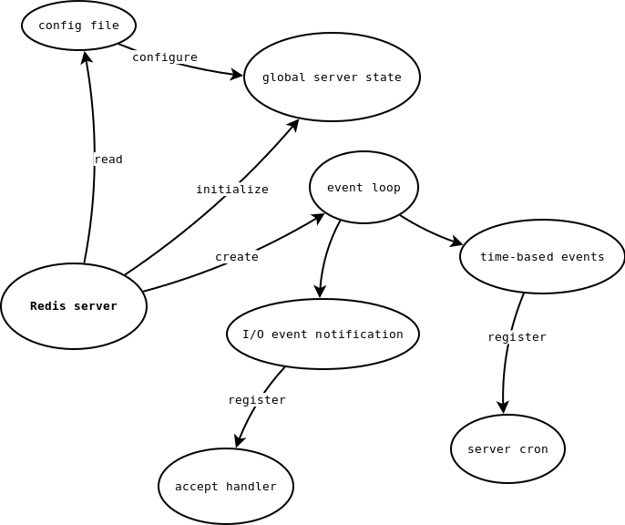
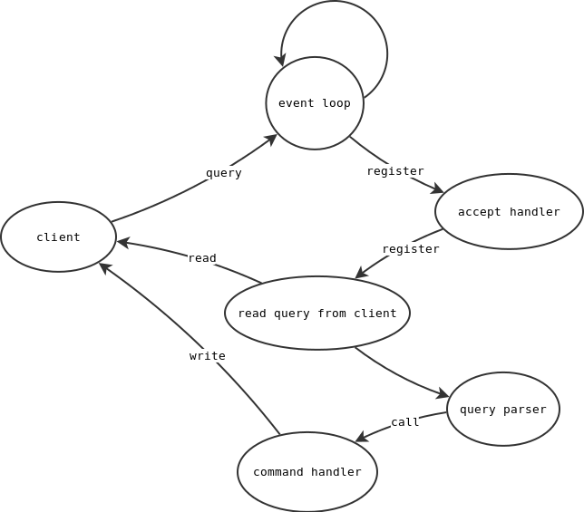

> 翻译自：https://www.pauladamsmith.com/articles/redis-under-the-hood.html
>
>译注：不遵循一字一句的翻译，不影响理解的可能直接略过，翻译时会加入自己的理解，尽量保证通顺，所以建议直接阅读原文


Redis服务是如何工作的？

我一直好奇想要知道Redis的内部结构，所以我一直在看Redis的源码。在剥了足够多的洋葱后，我意识到我尝试在我的脑海中保留足够多的细节，但我并不能清楚的知道它们是如果结合在一起的。所以我决定将Redis服务如何启动以及如何初始化记录下来，以及如何处理客户端的请求以及响应。算是作为向我自己解释的一种方式，希望能够说的清楚。幸运的是，Redis的代码写的非常优美，且容易阅读。通过[TAGS](http://ctags.sourceforge.net/)，我的编译器以及GDB，我得以看清它的底层原理。（顺便说一句，我看的是基于[b4f2e41此次提交](http://github.com/antirez/redis/tree/b4f2e412d087bae0a523fe6ea40fcad30fe74b5b)的源码）。当然我下面大纲列出来的内部结构可能已经发生了变化，但是总体架构不会有太多变化。

‍

* Do not remove this line (it will not be displayed)
{:toc}


## 启动

让我们从`redis.c`​中的`main()`​函数开始。

‍

### 开始全局server状态的初始化

​​

首先`initServerConfig()`​被调用，会部分初始化`server`​变量，它的类型是`struct redisServer`​，这个是全局状态变量。

```c
// redis.h:338
struct redisServer {
    pthread_t mainthread;
    int port;
    int fd;
    redisDb *db;
    // ...
};

// redis.c:69
struct redisServer server; /* server为全局状态变量 */
```

这个类型有大量的成员变量，但是它们会被分为如下几类：

* 一般的`server`​状态
* 统计
* 配置文件中配置
* 复制（replication）
* 排序参数
* 虚拟内存配置，状态，I/O线程，以及统计
* zip结构
* event loop工具
* pub/sub

例如，这个类型包含的成员对应配置文件（通常名为`redis.confg`​）中的选项，比如服务监听的端口，日志记录的级别，指向已连接的客户端列表，salve，以及Reids数据库本身的指针，以及用于统计从启动时已经处理的命令数的计数器。

`initServerConfig()`​为用户使用的`redis.conf`​文件中的配置对应的成员变量提供了默认值

‍

### 设置命令表（command table）

`main()`​函数做的另一件事是对Redis命令进行排序。这些命令定义在一个全局变量`readonlyCommandTable`​中，它是一个`struct redisCommands`​类型的数组。

```c
// redis.c:70
struct redisCommand *commandTable;
struct redisCommand readonlyCommandTable[] = {
    {"get",getCommand,2,REDIS_CMD_INLINE,NULL,1,1,1},
    {"set",setCommand,3,REDIS_CMD_BULK|REDIS_CMD_DENYOOM,NULL,0,0,0},
    {"setnx",setnxCommand,3,REDIS_CMD_BULK|REDIS_CMD_DENYOOM,NULL,0,0,0},
    {"setex",setexCommand,4,REDIS_CMD_BULK|REDIS_CMD_DENYOOM,NULL,0,0,0},
    {"append",appendCommand,3,REDIS_CMD_BULK|REDIS_CMD_DENYOOM,NULL,1,1,1},
    // ...
};

// redis.h:458
typedef void redisCommandProc(redisClient *c);
// ...
struct redisCommand {
    char *name;
    redisCommandProc *proc;
    int arity;
    int flags;
    // ...
};
```

这个只读表在源码中已经排序好了序，所以这些命令可以通过类型进行分组，比如string命令，list命令，set命令等。它让程序员可以轻易的查看类型的命令。这些排好序的命令表由全局变量`commandTable`​指向它，通过二分查找方法`lookupCommand()`​进行查找Redis命令，该方法返回一个指向`redisCommand`​的指针。

> `redisCommand`​类型会记录它的名字，例如`get`​ — 指针指向它实际执行的C函数，用于执行该命令；命令的有效性；命令标志，比如是否批量返回；以及一些特定虚拟机的成员变量

‍

### 加载配置文件

`main()`函数继续处理用户在启动Redis服务时的命令行选项。目前，除了版本参数`-v`和帮助参数`-h`外，Redis仅仅只会接收一个参数，即配置文件的路径。Redis加载配置文件，通过`initServerConfig()`方法去调用`loadServerConfig()`来重写默认的配置。这个函数非常的简单，遍历配置文件中的每一行，通过名字进行匹配，将其转变为`server`类型中对应的成员变量。这时，Redis将会在后台运行，并且将会从控制终端分离，如果进行了这种配置的话。


### initServer()

`initServer()`将会完成由`initServerConfig()`开始初始化的`server`变量。首先，它会设置一个信号处理（`SIGHUP`和`SIGPIPE`信号将会被忽略 — 让Redis有能力在收到`SIGHUP`信号时重新加载配置文件，与其他守护进程类似），以及如果服务在收到`SIGSEGV`信号时打印堆栈信息，见`segvHandler()`。

> 译注：这句话怪怪的，又说`SIGHUP`信号被忽略，又说要接收
>
> 在源码里面确实看到了这两个信号被忽略，但是后面的解释不知道咋得出来的
>
> ```c
> signal(SIGHUP, SIG_IGN);
> signal(SIGPIPE, SIG_IGN);
> ```

大量的双向链表会被创建（见`adlist.h`），用于记录客户端，slave，监视器（客户端会发送`MONITOR`命令），以及空闲对象列表。


#### 共享对象

一个有意思的事情是Redis创建了很多的共享对象，可以通过全局的`shared`变量进行访问。通用的Redis对象被许多不同的命令使用，比如响应字符串、错误信息。共享对象就不需要每次再进行分配，可以节省内存，但是在启动时会多做一点初始化工作。

```c
// redis.c:662
shared.crlf = createObject(REDIS_STRING,sdsnew("\r\n"));
shared.ok = createObject(REDIS_STRING,sdsnew("+OK\r\n"));
shared.err = createObject(REDIS_STRING,sdsnew("-ERR\r\n"));
shared.emptybulk = createObject(REDIS_STRING,sdsnew("$0\r\n\r\n"));
// ...
```


##### 共享整数

就节省内存来说，共享对象的最大影响来自大量的共享整数池。

```c
// redis.c:705
for (j = 0; j < REDIS_SHARED_INTEGERS; j++) {
    shared.integers[j] = createObject(REDIS_STRING,(void*)(long)j);
    shared.integers[j]->encoding = REDIS_ENCODING_INT;
}
```

`createSharedObjects()`创建了前10000个非负整数对象（整数编码的字符串）的数组。大量Redis对象比如strings，sets，以及lists都会包含许多小的整数（ID或者计数器），它们可以重用内存中已经分配的同一对象，节省了大量的内存。想象一下如果将`REDIS_SHARED_INTEGERS`这常量暴露在配置当中，让用户根据应用的需求来选择增加共享的整数将会节约大量的内存。代价是Redis在启动的时候静态的分配更多的内存，但是与整个数据库的大小以及潜在的节省相比，这只是很小的代价。

> 译注：不建议想象，因为目前是不支持在配置中改的，如果要改，只能改源码，那么就需要重新编译


#### Event loop 事件循环

`initServer()`继续创建核心的EventLoop，通过调用`aeCreateEventLoop()`（见`ae.c`），并将结果分配给`server`的成员变量`el`。

`ae.h`提供了一个基于操作系统的的包装器，用于设置I/O事件的通知循环，在Linux上使用`epoll`，在BSD上使用`kqueue`，如果在不满足的情况下会使用`select`。Redis的EventLoop会轮询新连接和I/O事件（从socket中读请求以及写请求），在新事件到达时会被触发。这就是为什么Redis响应如此之快，它可以同时处理几千个客户端的请求而不会阻塞。

> Redis关键的一个实现在于提供了一个本地的包装器，隐藏了通用任务的复杂性，在编译时期不需要增加额外的依赖。例如，`zmalloc.h`为`*alloc()`系列函数定义了大量的包装器，记录Redis分配了多少内存。`sds.h`为strings定义了相关API（记录了字符串的长度，以及它的内存是否可以被释放。


#### 数据库

`initServer()`还会初始化许多`redisDB`对象，它封装了Redis数据库的相关细节，包括记录过期的key，阻塞中的key（不管是来自`B{L, R}POP`命令还是I/O），以及监视在进行CAS的key。（默认情况下有16个独立的数据库，可以将其看作为Redis内部的命名空间）


#### TCP socket

`initServer()`是Redis用来设置监听连接的socket的地方（默认会绑定在6379端口）。另一个Redis的本地封装是`anet.h`，定义了`anetTcpServer()`，以及其他的函数用于简化设置新的socket，绑定与监听端口的复杂性。

```c
// redis.c:791
server.fd = anetTcpServer(server.neterr, server.port, server.bindaddr);
if (server.fd == -1) {
    redisLog(REDIS_WARNING, "Opening TCP port: %s", server.neterr);
    exit(1);
}
```


#### 定时任务

`initServer()`会进一步为数据库以及pub/sub分配各种dicts和lists，重置统计数据和各种标识，记录了服务启动时的UNIX时间戳。它将`serverCron`作为时间事件注册到EventLoop中，每隔100ms执行一次这个函数。（这个有点取巧，因为初始化的时候`initServer`将`serverCron()`设置在1毫秒内执行，是为了让定时任务在服务启动时立即执行，但是`serverCron()`的返回值是100，然后被插入到时间事件的下一次计算中进行处理）

`serverCron()`为Redis执行大量周期性的任务，包括打印数据库的大小（键的数量以及使用的内存）；已连接的客户端数量；调整哈希表的大小；关闭空闲/连接超时的客户端连接；执行任何后台`save`以及AOF重写；如果配置中的`save`条件已经满足，则执行后台的`save`（多少key在多少秒内发生了变化）；计算LRU信息并处理已经过期的key（Redis使用自适用的统计方法，在每一个定时任务的周期内仅仅只会淘汰一些过期时间的key，避免占用服务器资源，但是如果淘汰过期的key能够避免产生OOM，那么会选择淘汰更多的key）；如果开始了虚拟内存，则会将数据交换到磁盘；以及如果当前服务是slave则会与master进行同步。


#### 向EventLoop注册连接处理器

最重要的是，`initServer()`通过注册socket描述符将EventLoop与服务的TCP socket连接起来。注册`acceptHandler`函数，当接受一个新连接时被调用。（更多的细节见下面“处理请求”部分）

```c
// redis.c:821
if (aeCreateFileEvent(server.el, server.fd, AE_READABLE,
    acceptHandler, NULL) == AE_ERR) oom("creating file event");
```


#### 打开 AOF

如果配置了AOF，`initServer()`会创建或者打开AOF文件。

```c
// redis.c:824
if (server.appendonly) {
    server.appendfd = open(server.appendfilename,O_WRONLY|O_APPEND|O_CREAT,0644);
```

如果服务配置了虚拟内存，最终`initServer()`会再次初始化Redis虚拟内存系统。

> 译注：虚拟内存已被Redis废弃，见[Virtual memory (deprecated)](https://redis.io/docs/reference/internals/internals-vm/)，或者见译文[Redis虚拟内存](http://ifeve.com/redis-mem/)


### 回到 `main()`

如果配置了守护进程（daemonize），Redis将会尝试写出一个pid文件（路径是可配置的，默认是`/var/run/redis.pid`）

此时，服务已经启动，Redis会在日志文件中打印出来。但是在Redis完全准备好之前，`main()`还有更多的事情要做。


#### 恢复数据

如果存在AOF或者数据库的dump文件（比如`dump.rdb`），那么将会加载这个文件，将上一次会话的数据恢复到服务上（如果两者都存在，则AOF文件优先）

```c
// redis.c:1452
if (server.appendonly) {
    if (loadAppendOnlyFile(server.appendfilename) == REDIS_OK)
        redisLog(REDIS_NOTICE,"DB loaded from append only file: %ld seconds",time(NULL)-start);
} else {
    if (rdbLoad(server.dbfilename) == REDIS_OK)
        redisLog(REDIS_NOTICE,"DB loaded from disk: %ld seconds",time(NULL)-start);
}
```

现在服务已经准备好接收请求了。


#### EventLoop设置

最后，Redis注册了一个`beforeSleep()`的函数，每次进入EventLoop时都会被调用（因为进程在等待事件通知时，本质上是处于休眠状态）。`beforeSleep()`做两件事：如果启用了虚拟内存系统，处理客户端请求的key，会将其交换到磁盘上，以及将AOF刷到磁盘上。AOF的写入由`flushAppendOnlyFile()`处理，该函数封装了将包含待写入AOF的buffer刷入磁盘的复杂处理逻辑（具体的频率由用户配置）。


#### 进入EventLoop 

Redis现在通过调用`aeMain`进入主EventLoop中，参数是`server.el`（该成员变量包含了一个指向`aeEventLoop`的指针）。如果进程每次进入循环时，存在任何的时间事件（比如定时任务）或者文件事件，它们各自的处理函数将会被调用。`aeProcessEvents()`封装了这个逻辑 — 时间事件通过自定义逻辑处理，而文件事件通过底层的`epoll`或者`kqueue`或者`select`I/O事件通知系统处理。

因为Redis需要对时间事件以及文件或者I/O事件进行响应，所以它实现了一个自定义的事件轮询`aeMain()`。通过检查是否有任何的时间事件需要处理，以及利用文件事件通知，EventLoop可以有效的休眠，直到有工作需要做，并且不会在`while`循环中大量占用CPU。


## 处理请求并返回响应

我们现在进入Redis主EventLoop轮询中了，监听端口并等待客户端连接。是时候去看一下Redis是怎么处理命令请求了。



### 处理新连接

回到`initServer()`，Redis注册`acceptHandler()`在服务监听的socket文件描述符相关的I/O事件时被调用（比如，socket有数据等待读取或者写入）。`acceptHandler()`创建一个客户端对象 — 指向`redisClient`，该对象的结构定义在`redis.h`中 — 表示一个新客户端的连接。

```c
// networking.c:347
cfd = anetAccept(server.neterr, fd, cip, &cport);
if (cfd == AE_ERR) {
    redisLog(REDIS_VERBOSE,"Accepting client connection: %s", server.neterr);
    return;
}
redisLog(REDIS_VERBOSE,"Accepted %s:%d", cip, cport);
if ((c = createClient(cfd)) == NULL) {
    redisLog(REDIS_WARNING,"Error allocating resoures for the client");
    close(cfd); /* May be already closed, just ingore errors */
    return;
}
```

调用`createClient()`分配以及初始化一个客户端对象。默认选择`0`号数据库（因为每个服务至少有一个数据库），将在`acceptHandler()`中由[`accept(2)`](http://linux.die.net/man/2/accept)生成的客户端文件描述符与客户端对象关联起来。其他的标识以及成员变量都会被初始化，最终客户端会被添加到`server.clients`记录的客户端全局列表中。Redis在`createClient`中做的主要工作是在EventLoop中注册一个处理器`readQueryFromClient()`，该函数在客户端连接有数据时进行读取。

```c
// networking.c:20
if (aeCreateFileEvent(server.el,fd,AE_READABLE, readQueryFromClient, c) == AE_ERR)
{
    close(fd);
    zfree(c);
    return NULL;
}
```


### 从客户端读取命令

当客户端请求一个命令时，主EventLoop会调用`readQueryFromClient()`。（如果你通过GDB进行debug，该函数非常适合进行断点）。它会尽可能多的读取命令 — 最多为1024字节 — 到临时缓冲区，然后将命令追加到客户端特有的查询缓冲区中。这允许Redis处理大于1024字节的内容（命令名加上参数），由于I/O的原因会被分割成多个读取事件。然后它会调用`processInputBuffer()`，并将客户端对象通过参数进行传递。

```c
// networking.c:754
void readQueryFromClient(aeEventLoop *el, int fd, void *privdata, int mask) {
    redisClient *c = (redisClient*) privdata;
    // REDIS_IOBUF_LEN=1024
    char buf[REDIS_IOBUF_LEN];
    int nread;
    // ...

    nread = read(fd, buf, REDIS_IOBUF_LEN);
    // ...
    if (nread) {
        size_t oldlen = sdslen(c->querybuf);
        c->querybuf = sdscatlen(c->querybuf, buf, nread);
        c->lastinteraction = time(NULL);
        /* Scan this new piece of the query for the newline. We do this
         * here in order to make sure we perform this scan just one time
         * per piece of buffer, leading to an O(N) scan instead of O(N*N) */
        if (c->bulklen == -1 && c->newline == NULL)
            c->newline = strchr(c->querybuf+oldlen,'\n');
    } else {
        return;
    }
    Processinputbuffer(c);
}
```

`processInputBuffer()`会将客户端的原始查询解析为Redis命令执行的参数


‍
