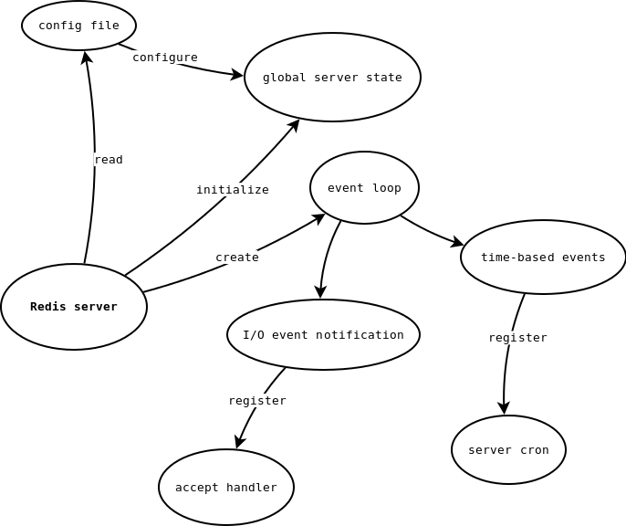

> 翻译自：https://www.pauladamsmith.com/articles/redis-under-the-hood.html
>
>译注：不遵循一字一句的翻译，不影响理解的可能直接略过，翻译时会加入自己的理解，尽量保证通顺，所以建议直接阅读原文


Redis服务是如何工作的？

我一直好奇想要知道Redis的内部结构，所以我一直在看Redis的源码。在剥了足够多的洋葱后，我意识到我尝试在我的脑海中保留足够多的细节，但我并不能清楚的知道它们是如果结合在一起的。所以我决定将Redis服务如何启动以及如何初始化记录下来，以及如何处理客户端的请求以及响应。算是作为向我自己解释的一种方式，希望能够说的清楚。幸运的是，Redis的代码写的非常优美，且容易阅读。通过[TAGS](http://ctags.sourceforge.net/)，我的编译器以及GDB，我得以看清它的底层原理。（顺便说一句，我看的是基于[b4f2e41此次提交](http://github.com/antirez/redis/tree/b4f2e412d087bae0a523fe6ea40fcad30fe74b5b)的源码）。当然我下面大纲列出来的内部结构可能已经发生了变化，但是总体架构不会有太多变化。

‍

* Do not remove this line (it will not be displayed)
{:toc}


## 启动

让我们从`redis.c`​中的`main()`​函数开始。

‍

### 开始全局server状态的初始化

​​

首先`initServerConfig()`​被调用，会部分初始化`server`​变量，它的类型是`struct redisServer`​，这个是全局状态变量。

```c
// redis.h:338
struct redisServer {
    pthread_t mainthread;
    int port;
    int fd;
    redisDb *db;
    // ...
};

// redis.c:69
struct redisServer server; /* server为全局状态变量 */
```

这个类型有大量的成员变量，但是它们会被分为如下几类：

* 一般的`server`​状态
* 统计
* 配置文件中配置
* 复制（replication）
* 排序参数
* 虚拟内存配置，状态，I/O线程，以及统计
* zip结构
* event loop工具
* pub/sub

例如，这个类型包含的成员对应配置文件（通常名为`redis.confg`​）中的选项，比如服务监听的端口，日志记录的级别，指向已连接的客户端列表，Redis从服务，以及Reids数据库本身的指针，以及用于统计从启动时已经处理的命令数的计数器。

`initServerConfig()`​为用户使用的`redis.conf`​文件中的配置对应的成员变量提供了默认值

‍

### 设置命令表（command table）

`main()`​函数做的另一件事是对Redis命令进行排序。这些命令定义在一个全局变量`readonlyCommandTable`​中，它是一个`struct redisCommands`​类型的数组。

```c
// redis.c:70
struct redisCommand *commandTable;
struct redisCommand readonlyCommandTable[] = {
    {"get",getCommand,2,REDIS_CMD_INLINE,NULL,1,1,1},
    {"set",setCommand,3,REDIS_CMD_BULK|REDIS_CMD_DENYOOM,NULL,0,0,0},
    {"setnx",setnxCommand,3,REDIS_CMD_BULK|REDIS_CMD_DENYOOM,NULL,0,0,0},
    {"setex",setexCommand,4,REDIS_CMD_BULK|REDIS_CMD_DENYOOM,NULL,0,0,0},
    {"append",appendCommand,3,REDIS_CMD_BULK|REDIS_CMD_DENYOOM,NULL,1,1,1},
    // ...
};

// redis.h:458
typedef void redisCommandProc(redisClient *c);
// ...
struct redisCommand {
    char *name;
    redisCommandProc *proc;
    int arity;
    int flags;
    // ...
};
```

这个只读表在源码中已经排序好了序，所以这些命令可以通过类型进行分组，比如string命令，list命令，set命令等。它让程序员可以轻易的查看类型的命令。这些排好序的命令表由全局变量`commandTable`​指向它，通过二分查找方法`lookupCommand()`​进行查找Redis命令，该方法返回一个指向`redisCommand`​的指针。

> `redisCommand`​类型会记录它的名字，例如`get`​—指针指向它实际执行的C函数，用于执行该命令；命令的有效性；命令标志，比如是否批量返回；以及一些特定虚拟机的成员变量

‍

### 加载配置文件

`main()`​函数继续处理用户在启动Redis服务时的命令行选项。目前，除了版本参数`-v`​和帮助参数`-h`​外，Redis仅仅只会接收一个参数，即配置文件的路径。Redis加载配置文件，通过`initServerConfig()`​方法去调用`loadServerConfig()`​来重写默认的配置。这个函数非常的简单，

‍
